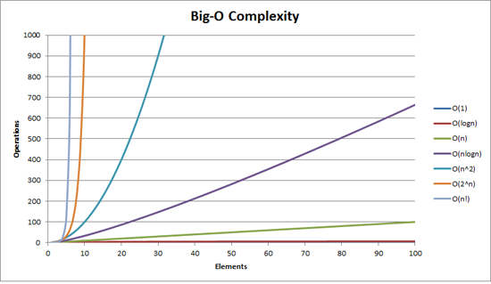

## 알고리즘

#### 알고리즘이란
어떤한 문제를 해결하기 위한 절차이다.

#### 알고리즘 효율
1. 공간적 효율성<br>
얼마나 많은 메모리 공간을 필요로 하는가.

2. 시간적 효율성<br>
얼마나 많은 시간을 필요로 하는가.

#### 시간 복잡도
문제를 해결하는데 걸리는 시간을 일반적으로 "점근 표기법"을 이용하여 나타낸다.

#### 점근 표기법
시간 복잡도는 HW, SW에 따라 시간이 모두 달라 측정하기가 어렵다<br>
그래서 점근 표기법을 이용해 시간 복잡도를 나타낼 수 있다.

- Θ (Big-Theta) : 점근적으로 근접한 한계값을 표현
- O (Big-Oh) : 실행 시간의 점근적 상한을 표현
- Ω (Big-Omega) ; 실행 시간의 점근적 하한을 표현

우리는 최악의 상황에서 시간을 알아내는 것을 더 중요하게 여기기 때문에
보통 O (Big-Oh) 표기법을 많이 사용한다.

아래는 N에 따라 수행되는 속도를 보여주는 이미지이다.<br>


#### 시간 복잡도 구하기
시간복잡도를 구하는 방법은.
``` java
for (int i = 0; i < N; i++) {
    System.out.println(i + 1);
}
```

int i = 0를 선언하고 +1을 하고 이런 코드들이 있지만<br>
결국 최고차항을 제외한 모든 항과 최고차항의 계수를 제외시키고
O(N) 이라고 표시한다.
